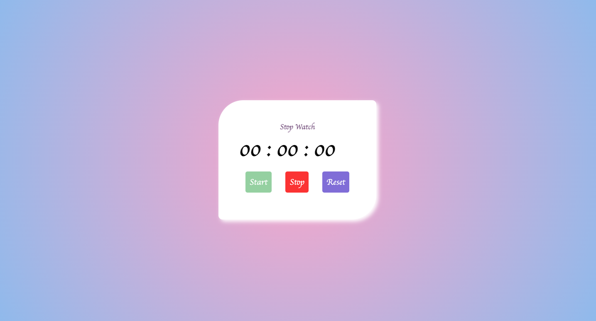
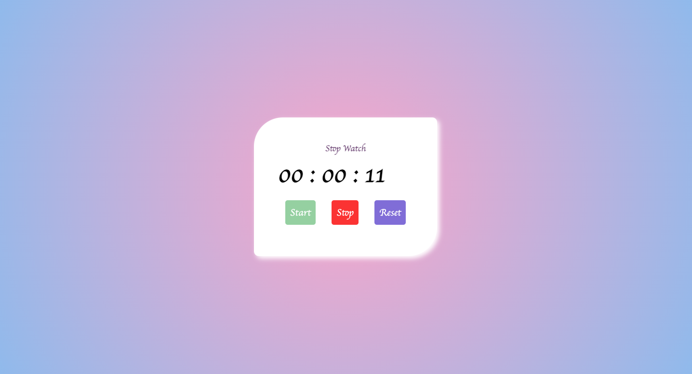

# ⏱️ Stop Watch

A simple and interactive **Stop Watch web application** built using **HTML, CSS, and JavaScript**.  
This project allows users to measure elapsed time, start/pause and reset the timer with ease.

---

## 🚀 Live Demo

Try the stopwatch live here:  
🔗 **GitHub Pages:**  
https://samnsaife.github.io/Stop-Watch/

---

## 📸 Screenshots

### ⏱️ Stopwatch UI  


### ⏱️ Timer Running  


---

## 📌 Features

✔ Start timing  
✔ Pause/Stop timer  
✔ Reset timer  
✔ Millisecond precision  
✔ Clean and user-friendly interface  

---

## 📂 Project Structure

```
Stop-Watch/
├── index.html        # Main HTML UI
├── style.css         # Styling for stopwatch
├── script.js         # Functionality & logic
├── README.md         # Project documentation
└── screenshots/      # Preview images for README
```
---

## 🛠️ Built With

- **HTML5**
- **CSS3**
- **JavaScript (ES6)**

---

## 📖 How It Works

This stopwatch uses JavaScript’s `setInterval()` function to increment time in intervals of milliseconds and displays updates on the screen.  
Users can:

🔹 Click **Start** to begin  
🔹 Click **Stop** to pause  
🔹 Click **Reset** to clear

---

## 🚀 Getting Started Locally

To run this project locally on your system:

1. Clone the repository:

```bash
https://github.com/samnsaife/Stop-Watch.git
```

2. Open the project folder:

```bash 
cd Stop-Watch
```

3. Open index.html in your browser:

```bash 
open index.html
```
or simply double-click it.


👩‍💻 Author
------------

Sami Noor Saifi
